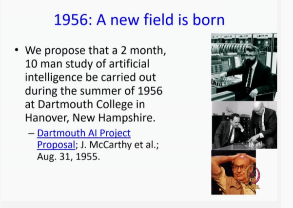
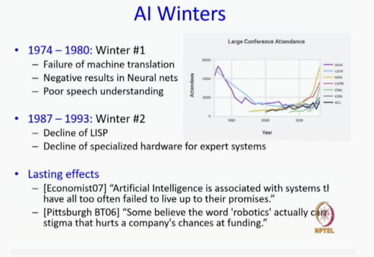
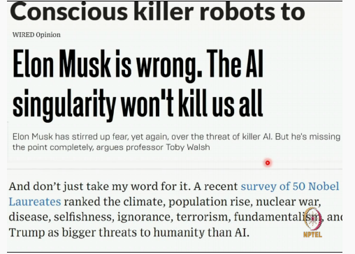

# Goals of this course
* A brief intro to the philosophy of Al
* A brief intro to the breadth of ideas in Al
* General computer scientist
    * general tools to aid in attacking a new problem
* Serious AI enthusiast
    * A primer from which to launch advanced study

## Theory vs Modelling vs Applications
Lecture balance tilted towards modeling  
Assignment balance tilted towards applications  
Relatively few theorems and even fewer proofs  
Desired work — lots!  

* 1946: ENIAC heralds the dawn of Computing

## Introduction: Definition of AI Dictionary Meaning, Part-6

## What is intelligence
* Dictionary.com: capacity for learning, reasoning,
understanding, and similar forms of mental activity  
* Ability to perceive and act in the world  
* Reasoning: proving theorems, medical diagnosis  
* Planning: take decisions  
* Learning and Adaptation: recommend movies,  
learn traffic patterns
* Understanding: text, speech, visual scene  

## Intelligence vs Humans
* Are humans intelligent?
— replicating human behavior early hallmark Of intelligence
* Are humans always intelligent?
* Can non-human behavior be intelligent?

## Introduction: Definition of AI Thinking vs Acting Humanly vs Rationally, Part-7

## Thinking Rationally : laws of thought
Aristotle: what are correct arguments/thought
processes?
— Logic
Problems
— Not all intelligent behavior is mediated by logical
deliberation (reflexes)
— What is the purpose of thinking?