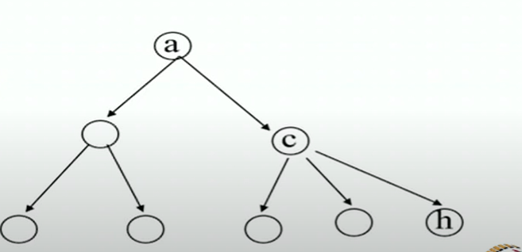

# Uninformed Search

Chapter 3
(Based on slides by Stuart Russell, Subbarao Kambhampati,
Dan Weld, Oren Etzioni, Henry Kautz, Richard Korf, and
other UVV-AI faculty)

## What is a State?
* All information about the environment
* All information necessary to make a decision for the task at hand.
## Agent's Knowledge Representation

|Type|State representation|Focus|
|--|--|--|
|Atomic|States are indivisible; No internal structure|Search|
|Propositional(aka factored)|States are made of state variables that take values(Propositional or Multivalued or Continuous)|Search+Inferencein logical (Prop logic) and probabilistic (bayes nets) representations|
|Relational|States describe the objects in the world and their inter-relations|Search+Inference in predicate logic (or relational prob. Models)|
|First-order|+functions over objects|Search+lnference in first order logic (or first order probabilistic models)|

## Atomic Agent
* Input
    * Set of States
    * Operators[and costs]
    * Start state
    * Goal state[test]
* Output
    * Path: start => a state satisfying goal test
    * [May require shortest path]

## Example - The 8-puzzle

* States? locations of tiles
* actions? move blank left, right, up down
* goal test? = goal state(given)
* path cost? 1 per move

* [Note : optimal solution of n-Puzzle family is NP-hard]

## Example - Romania
* On holiday in Romania; currently in Arad.
* Flight leaves tomorrow from Bucharest
* Formulate goal:
    * be in Bucharest
* Formulate problem:
    * states: various cities
    * actions: drive between cities
* Find solution:
    * sequence of cities, e.g., Arad, Sibiu, Fagaras, Bucharest

## Example - N Queens

## Implementation - states vs nodes

## Uniformed Search: Basic Search Strategies Part-3

### Search strategies
* A search strategy is defined by picking the **order Of node expansion**
* Strategies are evaluated along the following dimensions:
    * **completeness:** does it always find a solution if one exists?
    * **time complexity:** number of nodes generated
    * **space complexity:** maximum number Of nodes in memory
    * **optimality:** does it always find a least-cost solution?
    * **systematicity:** does it visit each state at most once?
* Time and space complexity are measured in terms of
    * b: maximum branching factor Of the search tree
    * d: depth Of the solution
    * m: maximum depth of the state space (may be infinity)

### Uninformed search strategies
* **Uninformed** search strategies use only the information
available in the problem definition
* Breadth-first search
* Depth-first search
* Depth-limited search
* Iterative deepening search

### Repeated States
* Failure to detect repeated states can turn a linear problem into an exponential one

### Depth First Search
* Maintain stack of nodes to visit
* Evaluation
    * Complete?
        * No. what if subtree never ends?
    * Time Complexity?
        * O(b^m)
    * Space complexity?
        * O(bm)

### Breadth First Search - shortest first
* Maintain queue of nodes to visit
* Evaluation
    * Complete?
        * Yes (b is finite). We will assume in our AI courses
    * Time Complexity?
        * O(b^d)
    * Space Complexity?
        * O(b^d)
    * Optimal?
        * Yes, ifstepcost = 1

### Uniform Cost Search - Cheapest first
* Maintain queue of nodes to visit
* Evaluation
    * Complete?
        * Yes(b is finite)
    * Time Complexity?
        * O(b^(C*/epsilon))
    * Space Complexity?
        * O(b^(C*/epsilon))
    * Optimal?
        * Yes

BFS and Uniform Cost search are kind of same?

## Uniformed Search: Iterative Deepening DFS Part-4

* Which is better DFS or BFS?
* Which is more important? Time or space?
    
### Memory Limitation
* Suppose
    * 2 GHz CPU
    * 1 GB main memory
    * 100 instruction/expansion
    * 5 bytes/node

200,000 expansions/sec
Memory filled in 100 sec ... < 2 minutes

### Idea 1 : Beam Search
* Maintain a constant sized frontier
* Whenever the frontier becomes large
    * Prune the worst nodes

Optimal - no
complete - no

### Idea 2 : Iterative deepening search
Iterative Deepening Search (IDS) is a search algorithm that combines the space efficiency of Depth-First Search (DFS) with the completeness and optimality of Breadth-First Search (BFS).

🧠 Core Idea:
Iterative Deepening Search performs DFS up to a certain depth limit, and repeats it by increasing the depth limit step-by-step, until the goal is found.

* Complete? - Yes
* Time? - O(b^d)
* Space? - O(bd)
* Optimal?
    * Yes, if step cost = 1
    * can be modified to explore uniform cost tree(iterative lengthening)
* Systematic?

## Uniformed Search: Bidirectional Search Part-5

