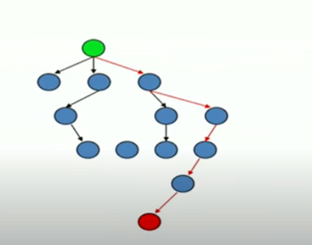

# Informed Search: Best First Search Part-1

"Intuition, like the rays of the sun, acts only  
in an inflexibly straight line; it can guess  
right only on condition of never diverting  
its gaze; the freaks of chance disturb it."  
-- Honore de Balzac

## Informed(Heuristic) Search
* Idea - be smart about what paths to try



### Blind Search vs. Informed Search
* What's the difference?
* How do we formally specify this?
    * A node is selected for expansion based on an evaluation function that estimates cost to goal.

### General Tree Search Paradigm

```txt
function tree-search(root-node)
    fringe <-- successors(root-node)
    while ( notempty(fringe) )
        {node<--remove-first(fringe) //lowest f value
            state<--state(node)
            if goal-test(state) return solution(node)
            fringe<--insert-all(successors(node),fringe) }
    return failure
end tree-search
```

### General Graph Search Paradigm

```txt
function tree-search(root-node)
    fringe<--successors(root-node)
    explored<--empty
    while ( notempty(fringe) )
        {node<--remove-first(fringe)
            state<--state(node)
            if goal-test(state) return solution(node)
            explored<--insert(node,explored)
            fringe<--insert-all(successors(node),fringe),if node not in explored)
return failure
end tree-search
```
## Best-First Search
* Use an evaluation function f(n) for node n.
* Always choose the node from fringe that has the lowest f value.

